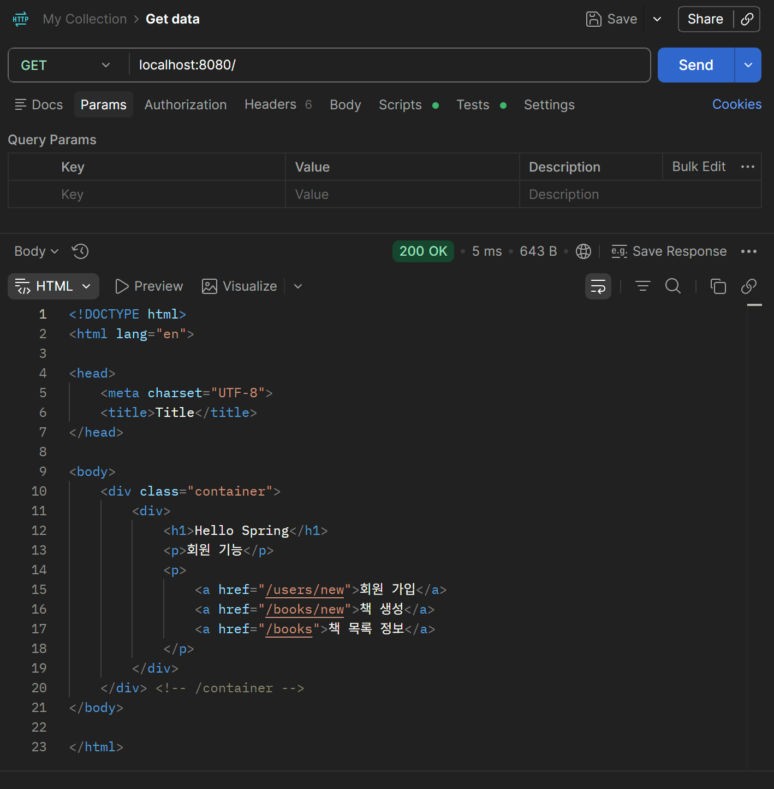
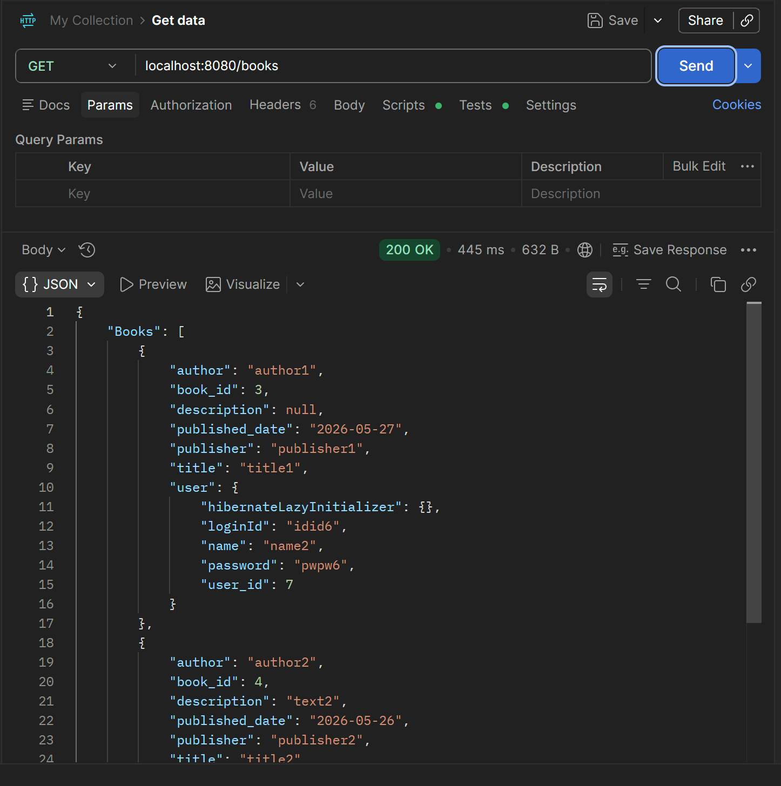
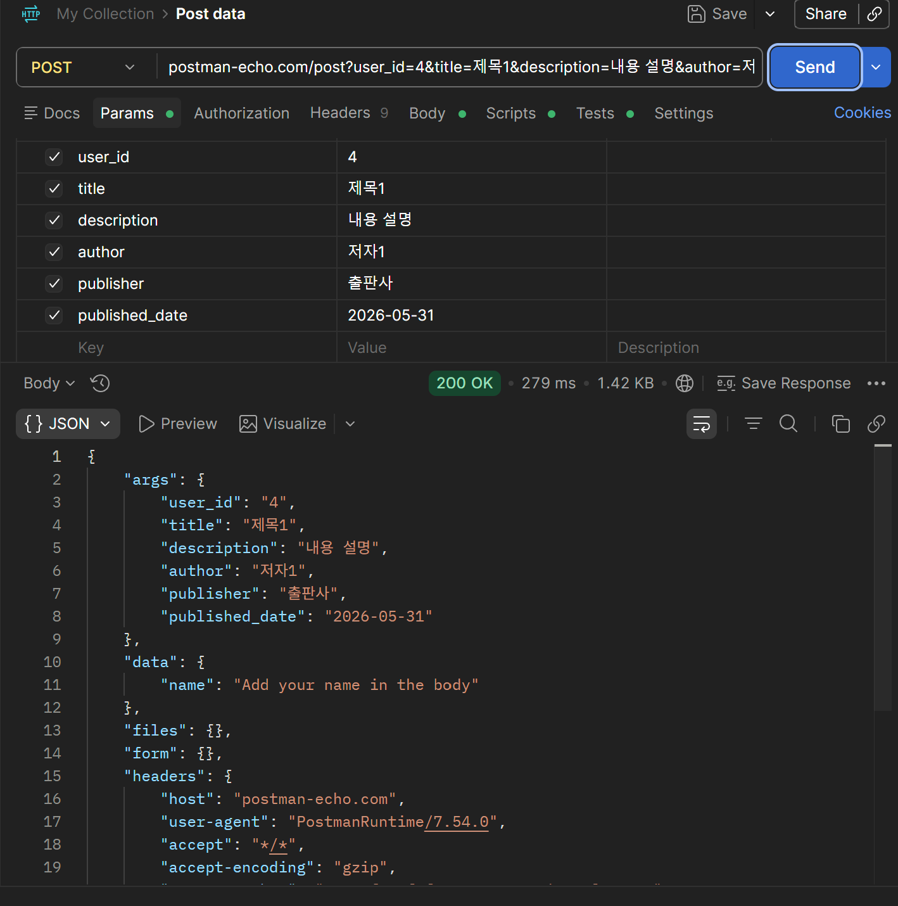
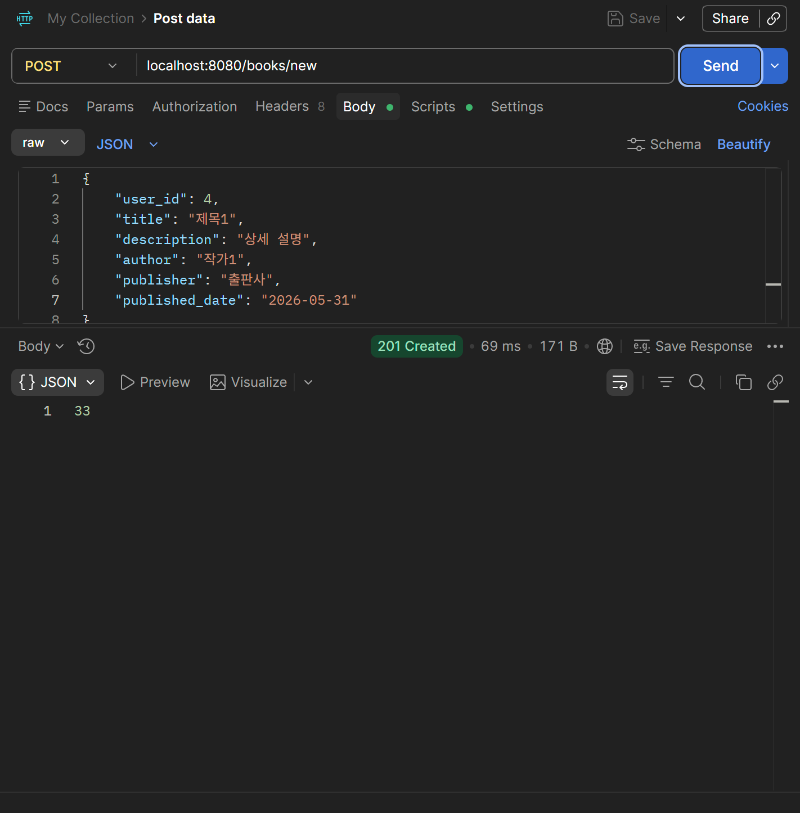
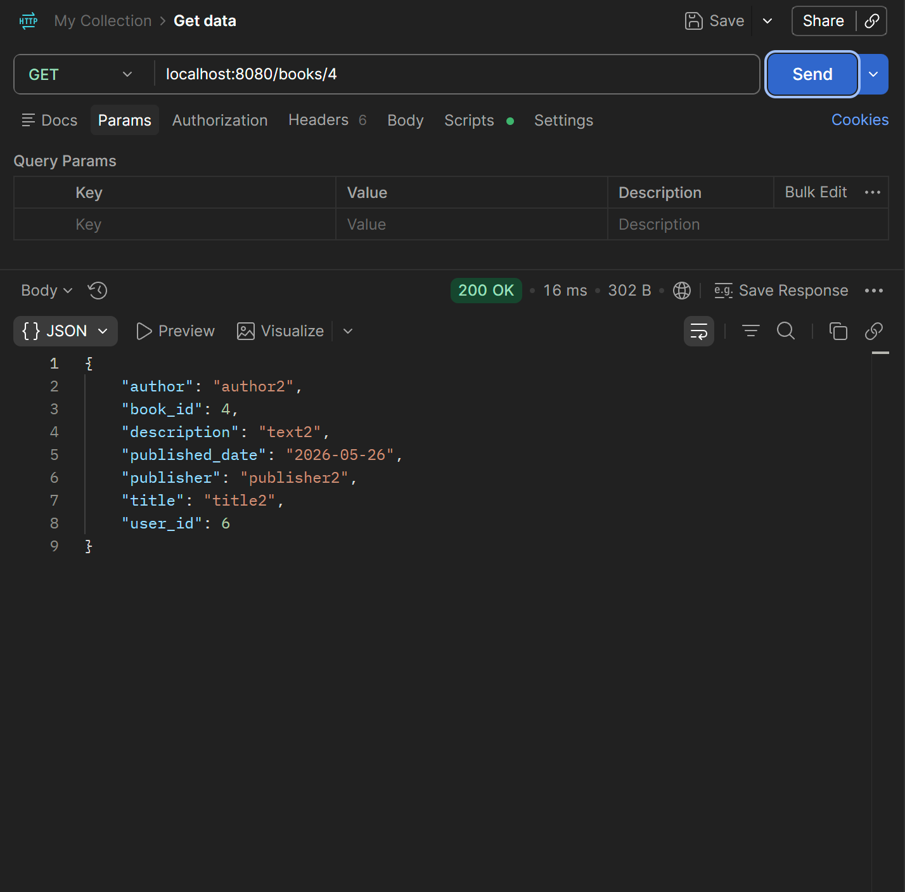
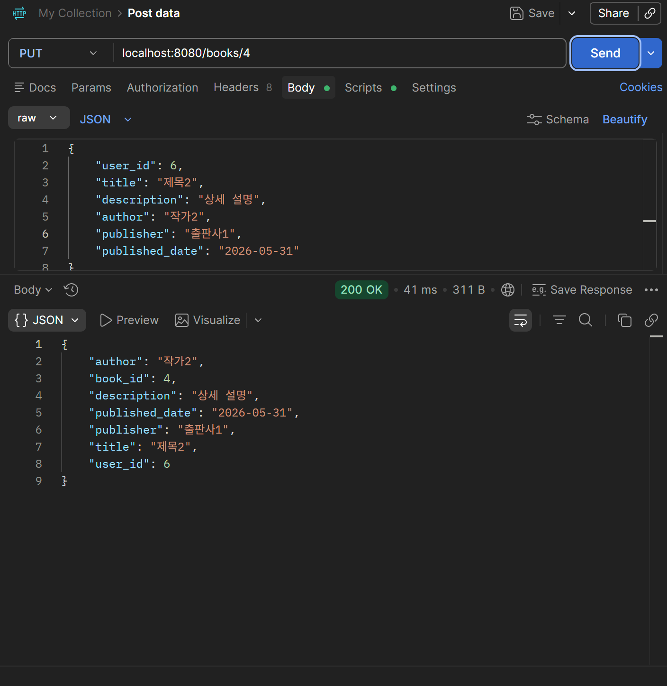
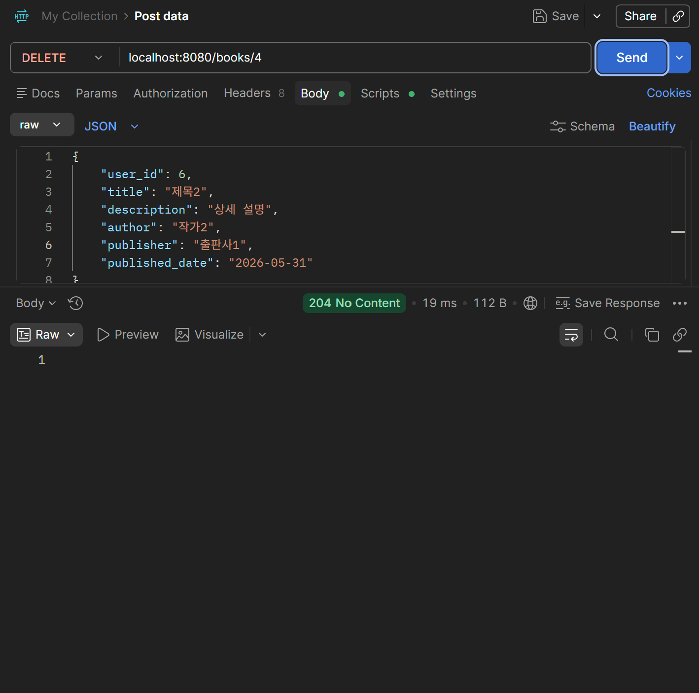
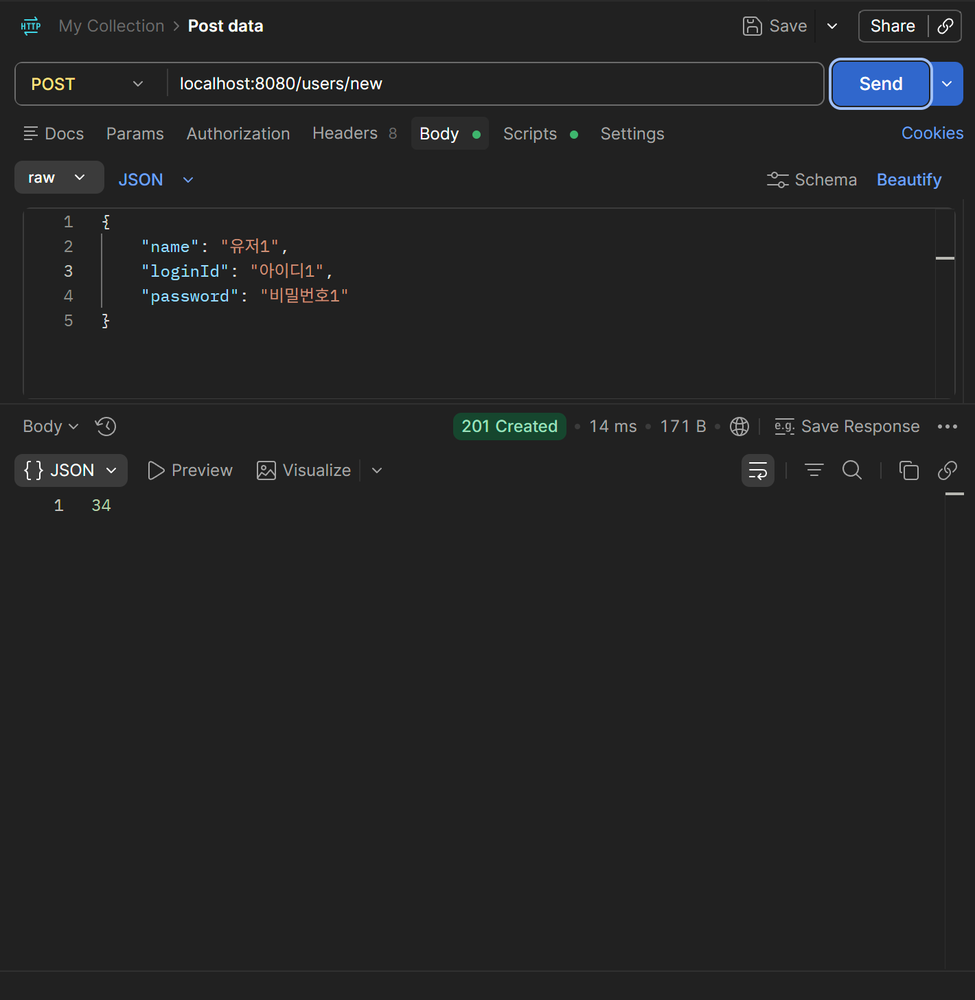
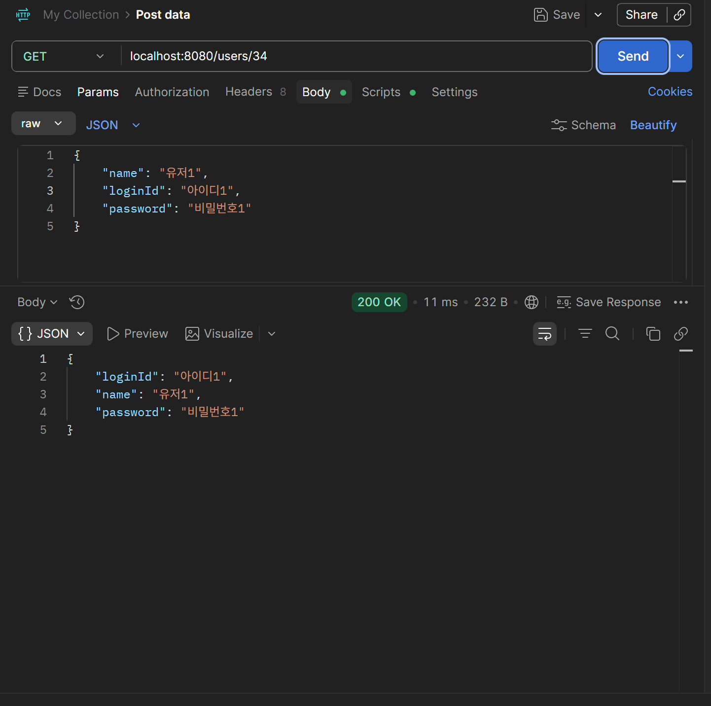
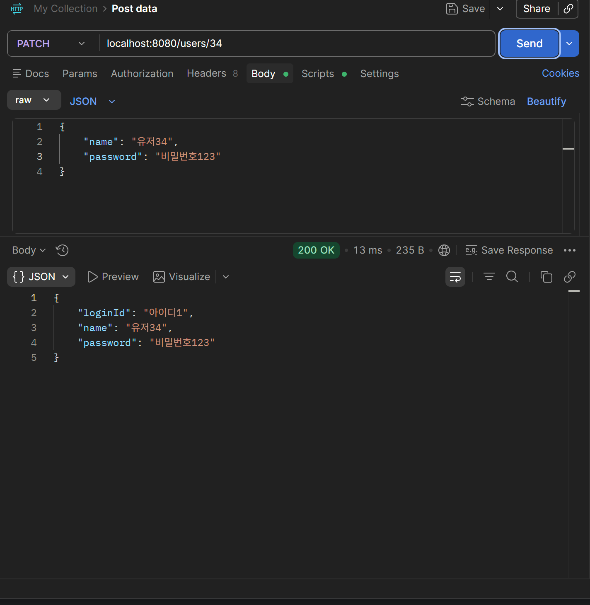

# MicroLibAPI

## 기능 명세서

| 유형         | 주 기능          | 상세 기능          | 설명                                                                    |
| ------------ | ---------------- | ------------------ | ----------------------------------------------------------------------- |
| 1. 회원 관리 | 1.1. 회원 생성   | 1.1.1. 회원가입    | (POST) 아이디, 비밀번호, 이름을 입력받아 회원 생성                      |
|              | 1.2 정보 조회    |                    | (GET) 마이페이지에서 회원 본인의 정보 확인                              |
|              | 1.3 정보 수정    |                    | (PATCH) 마이페이지에서 회원 본인의 정보 수정                             |
| 2. 책 관리   | 2.1. 책 생성     | 2.1.1. 생성        | (POST) 책 제목, 작가, 출판사, 출판년도, 작성자 정보를 입력 받아 책 생성 |
|              | 2.2 책 목록      | 2.2.1 책 목록 정보 | (GET) DB에서 책 목록을 받아 화면에 출력                                 |
|              | 2.3 책 상세 보기 |                    | (GET) 책 목록에서 책 클릭 시 해당 책의 상세 정보 확인                   |
|              | 2.4 수정         |                    | (PUT) 책 상세 보기에서 본인이 작성하였다면 수정 가능                    |
|              | 2.5 삭제         |                    | (DELETE) 책 상세 보기에서 본인이 작성하였다면 삭제 가능                    |

## ERD

**회원 1 : N 책**

## API 명세서

| 기능 | 메서드 | 요청 주소 | INPUT | OUTPUT | 상태코드 |
| --- | --- | --- | --- | --- | --- |
| 회원가입 | POST | users/new | UserCreateRequestDTO |  | 201 Created |
| 회원 정보 확인 | GET | users/${user_id} |  | UserResponseDTO | 200 OK |
| 회원 정보 수정 | PATCH | users/${user_id} | UserPatchRequestDTO |  | 200 OK |
| 책 생성 | POST | books/new | BookCreateRequestDTO |  | 201 Created |
| 책 목록 | GET | books |  | BookListResponseDTO | 200 OK |
| 책 상세보기 | GET | books/${book_id} |  | BookResponseDTO | 200 OK |
| 책 정보 수정 | PUT | books/${book_id} | BookUpdateRequestDTO | BookResponseDTO | 200 OK |
| 책 삭제 | DELETE | books/${book_id} | BookDeleteRequestDTO |  | 204 No Content |

## DTO

| DTO | field |
| --- | --- |
| UserCreateRequestDTO | user_name: (String), login_id: (String), password: (String) |
| UserResponseDTO | user_name: (String), login_id: (String), password: (String) |
| UserPatchRequestDTO | user_name: (String), login_id: (String), password: (String) |
| BookCreateRequestDTO | user_id : (int), title: (String), description: (String), author: (String), publisher: (String), published_date : (LocalDate) |
| BookListResponseDTO | List<Book> |
| BookResponseDTO | book_id : (int), user_id : (int), title: (String),description: (String), author: (String), publisher: (String), published_date : (LocalDate) |
| BookUpdateRequestDTO | user_id : (int), title: (String), description: (String), author: (String), publisher: (String), published_date : (LocalDate) |
| BookDeleteRequestDTO | user_id : (int) |

## PostMan

- 강의에서 배운 내용 중 이번에 직접 써본 것 3가지
    - SpringDataJpaRepository를 활용하여 기본적으로 제공되는 메서드 활용
    - Controller를 이용하여 GET, POST, DELETE등 fetch로 받는 명령 수행
    - MVC를 분리하여 독립적인 스프링 구현
- **왜 Controller에서 엔티티를 직접 받지 않고 DTO로 분리했는지** 본인의 언어로 답하기
    - Controller에서 Service로 Entity를 직접 보내게 되면 필요한 부분말고 불필요한 데이터 또한 전송되게 된다. 이는 단순히 네트워크 상의 불필요한 정보 전달로 인한 낭비도 있지만 보안적인 부분에서도 문제가 생길 수 있음을 알게 되었고, 이를 DTO로 분리함으로써 두 가지의 문제를 해결할 수 있었다.
- 막혔던 부분 1가지와 어떻게 해결했는지
    - @Controller를 사용하면 HTML간의 이동도 연결할 수 있지만, 상태코드 반환에 있어서는 부족한 부분이 있었다. 그로 인해 @Controller를 @RestController로 리펙토링 하게 되었는데 RestController는 HTML간의 이동을 조작할 수 없었기에 실제로 작동하는지 확인하는데에 어려움이 있었다.
    - 기존에 스프링 부트를 작동해서 페이지에서 직접 조작하는 방식 대신에 Test Code를 적극적으로 활용하게 되었고, Test Code의 중요성을 알게 되었다.
