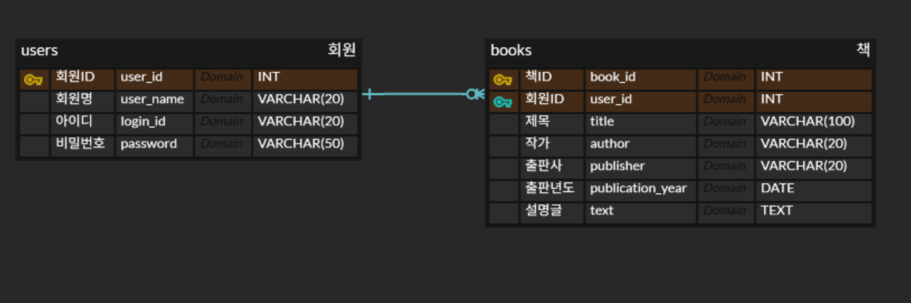

# MicroLibAPI

## 기능 명세서

| 유형         | 주 기능          | 상세 기능          | 설명                                                                    |
| ------------ | ---------------- | ------------------ | ----------------------------------------------------------------------- |
| 1. 회원 관리 | 1.1. 회원 생성   | 1.1.1. 회원가입    | (POST) 아이디, 비밀번호, 이름을 입력받아 회원 생성                      |
|              | 1.2 정보 조회    |                    | (GET) 마이페이지에서 회원 본인의 정보 확인                              |
|              | 1.3 정보 수정    |                    | (POST) 마이페이지에서 회원 본인의 정보 수정                             |
| 2. 책 관리   | 2.1. 책 생성     | 2.1.1. 생성        | (POST) 책 제목, 작가, 출판사, 출판년도, 작성자 정보를 입력 받아 책 생성 |
|              | 2.2 책 목록      | 2.2.1 책 목록 정보 | (GET) DB에서 책 목록을 받아 화면에 출력                                 |
|              | 2.3 책 상세 보기 |                    | (GET) 책 목록에서 책 클릭 시 해당 책의 상세 정보 확인                   |
|              | 2.4 수정         |                    | (GET) 책 상세 보기에서 본인이 작성하였다면 수정 가능                    |
|              | 2.5 삭제         |                    | (GET) 책 상세 보기에서 본인이 작성하였다면 삭제 가능                    |

## ERD

**회원 1 : N 책**

## API 명세서

| 기능           | 메서드 | 요청 주소        | INPUT                | OUTPUT              |
| -------------- | ------ | ---------------- | -------------------- | ------------------- |
| 회원가입       | POST   | users/new        | UserCreateRequestDTO |                     |
| 회원 정보 확인 | GET    | users/${user_id} |                      | UserResponseDTO     |
| 회원 정보 수   | PATCH  | users/${user_id} | UserPatchRequestDTO  |                     |
| 책 생성        | POST   | books/new        | BookCreateRequestDTO |                     |
| 책 목록        | GET    | books            |                      | BookListResponseDTO |
| 책 상세보기    | GET    | books/${book_id} |                      | BookResponseDTO     |
| 책 정보 수정   | UPDATE | books/${book_id} | BookUpdateRequestDTO |                     |
| 책 삭제        | DELETE | books/${book_id} | BookUpdateRequestDTO |                     |
